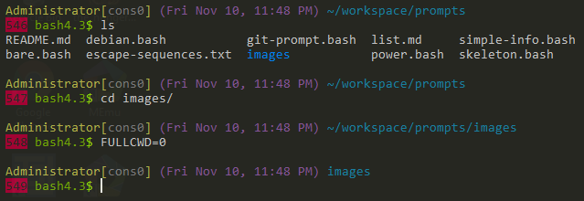

# [git-prompt](git-prompt.bash)

    git-repo@branch cwd (sha1 files-changed)
    $ 

# [simple-info](simple-info.bash)

    exit-code time-24hr basename branch $ 

# [power](power.bash)

    User[console] (Date, time) directory
    bash-version$ 