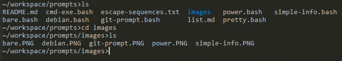
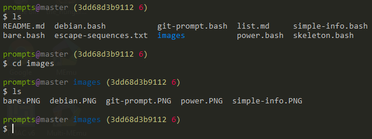
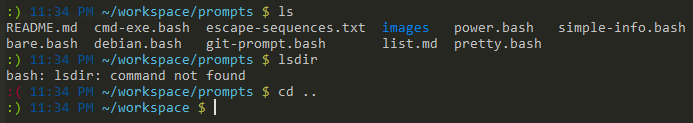

# [bare](bare.bash)

    contains a green > for every command that executed successfully and a red > for every command that exited with a nonzeor exit code.

 - Call `reset_prompt` to reset the prompt to one green <code>&gt;</code>.

# [cmd.exe](cmd-exe.bash)

    cwd>

# [debian](debian.bash)

    username@hostname:cwd$

# [git-prompt](git-prompt.bash)

    git-repo@branch cwd (sha1 files-changed)
    $ 

# [pretty](pretty.bash)

    [:) for success, :( for error] time-with-pretty-color cwd $

# [power](power.bash)

    User[console device] (date, time) directory
    shell-version$ 

 - Set `$FULLCWD` to `0` to print the basename instead of the full directory name.

# [simple-info](simple-info.bash)

    exit-code time-24hr basename branch $ 

 - Set `$FULLCWD` to `1` to print the full directory name instead of the basename.
